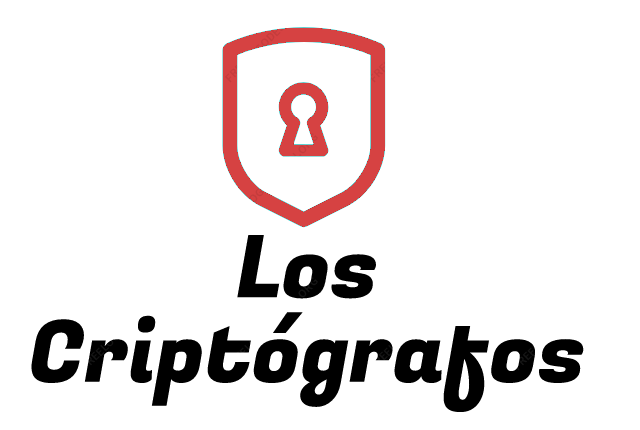

# TPCripto -Trabajo Práctico de la materia Criptografía y Seguridad

    

## Guía de comandos para desarrollo:

|        Comando |                        Función                        |
| -------------: | :---------------------------------------------------: |
|         `make` |           Genera los archivos ejecutables.            |
|  `make format` | Formatea todos los archivos .c bajo un mismo standard |
|   `make check` |        Correr el analizador estático CPP-CHECK        |
|    `make test` |                 Corre todos los tests                 |
|   `make clean` |               borra todos los archivos                |
|  `make cscope` |            Arma la base de datos de cscope            |
| `make csclean` |           Limpia la base de datos de cscope           |

El comando `make` genera todos los archivos dentro de la carpeta actual. Si se encuentra dentro del directorio raíz, ejecuta todos los make dentro de las subcarpetas.
